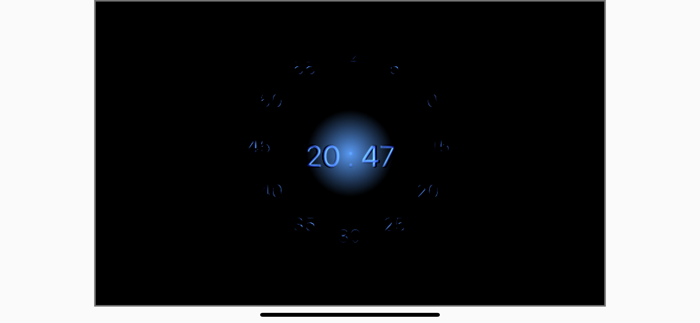

# Flutter Clock

My clock face for the [Flutter Clock challenge](https://flutter.dev/clock).

The app is located in the [bumped_clock](bumped_clock) directory.

The clock is rendered using a 2D bump mapping technique. Everything is procedurally generated and there are no assets. It responds to the clock format and weather condition changes.
It has been built on the top of the [Analog Clock](analog_clock) and has no additional external dependencies (only those used by the example Analog Clock).

The preview of the app running on an iPhone 7 Plus:

### Screenshot:

### GIF:

### Video:
[Video](./bumped_clock.MP4)

# License
[MIT](bumped_clock/LICENSE)
